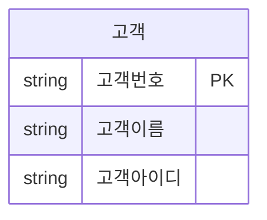
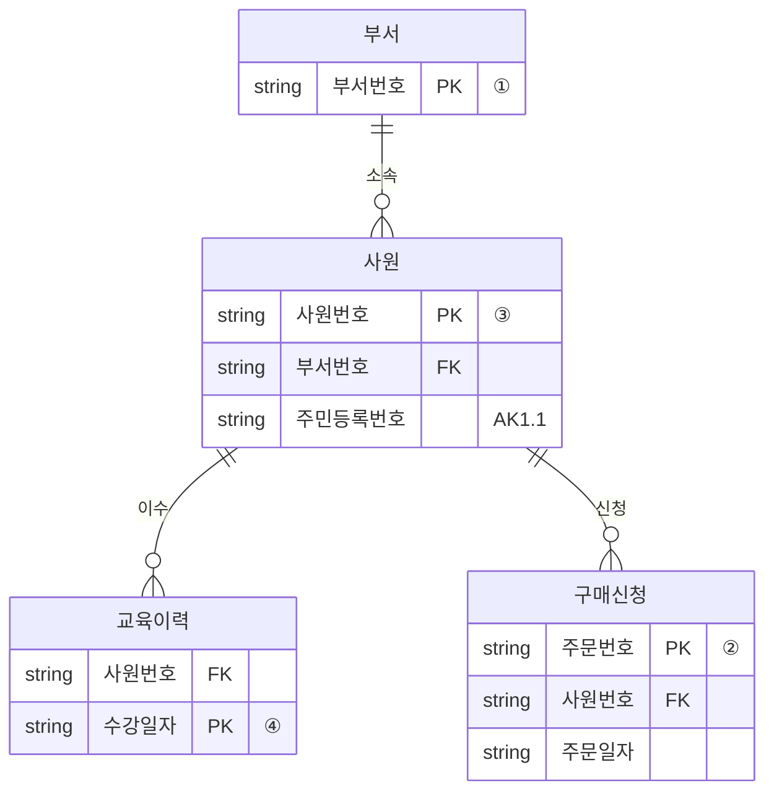
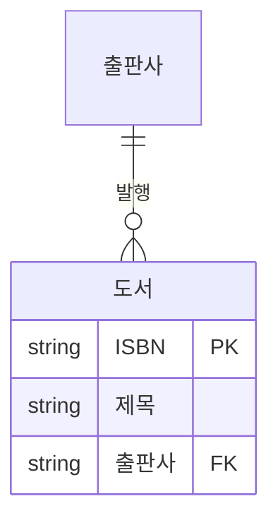
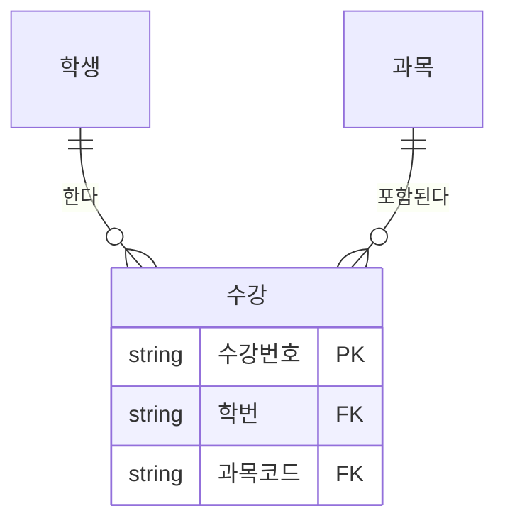

# Feat 인계 — ERD mermaid 다이어그램 컴포넌트

작성일: 2026-04-28
작성자: 콘텐츠/QA 채팅
대상: 기능 개발 채팅
관련: PR #98 (entityName 라벨 수정), PR #99 (preText 1줄 ASCII 렌더)

## 한 줄 요약

PR #99로 `preText`를 모노스페이스 한 줄로 표시하게 했지만 사용자 피드백 "ERD가 나와야 하는데 그냥 표임" — 한 줄 ASCII로는 ERD라기엔 약함. 이미 dependencies에 있는 **mermaid**로 진짜 ER 다이어그램을 그리도록 컴포넌트 교체.

---

## 배경

### 현재 한계

PR #99에서 `RefEntityDiagram`이 `preText` 필드를 `<pre>` 모노스페이스 블록으로 렌더하지만:
- 한 줄 ASCII (`[ 학생 ] ─|─ ─ ─o∈ [ 수강 ] ∋─ ─ ─o|─ [ 과목 ]`)는 시각적으로 텍스트 한 줄
- crow's foot, optional 마커가 아주 작아 학습자가 IE notation으로 인식하기 어려움
- 시험지에서 보던 박스+선 ERD와 거리감

### 활용 가능한 자산

`package.json`에 이미 **`mermaid: "^11.14.0"`** 들어있고, `TheoryScreens.tsx` line 223에서 dynamic import 패턴으로 사용 중:
```tsx
import('mermaid').then(({ default: mermaid }) => {
  mermaid.initialize({
    startOnLoad: false,
    theme: 'base',
    themeVariables: {
      fontFamily: 'Pretendard Variable, …',
      primaryColor: '#EBF5EC',  // 양파 그린
      …
    },
  });
  mermaid.run({ nodes });
});
```

mermaid의 `erDiagram` 문법은 SQLD IE notation crow's foot을 거의 그대로 표현 가능.

---

## 데이터 스키마 제안

### 옵션 A (권장) — mermaid 코드 직접 저장

```typescript
| { type: 'erd';
    mermaid: string;            // erDiagram 본문
    caption?: string;
    instanceTable?: {           // 옵션 — 인스턴스 표 (현재 entity-diagram의 headers/rows 대체)
      of: string;               // 어느 엔터티의 인스턴스인지 라벨
      headers: string[];
      rows: string[][];
    };
  }
```

**장점**:
- 컴포넌트 단순 (mermaid 코드 그대로 렌더)
- 작성자가 mermaid 문법만 알면 됨
- 추후 mermaid 외 라이브러리로 교체 시 데이터만 변환

**단점**:
- 데이터에 mermaid 코드 박힘 — 단점이라기보단 의도된 트레이드오프

### 옵션 B — 구조화된 데이터 → 컴포넌트가 mermaid 변환

```typescript
| { type: 'erd';
    entities: Array<{ name: string; attributes?: {name, isPK?, isFK?}[] }>;
    relationships: Array<{ from, to, fromCard, toCard, fromOptional, toOptional, label? }>;
  }
```

**장점**: 데이터 의미론적, 다른 렌더로 교체 자유
**단점**: 컴포넌트가 복잡, mermaid 코드 생성 로직 필요

→ **A안 권장**. 빠르고 단순. 4건만 마이그레이션하면 되는 규모.

### 기존 `entity-diagram`은?

3가지 처리 옵션:
1. **유지 + erd 추가** — 두 타입 공존, 작성자가 선택
2. **erd로 마이그레이션 + entity-diagram deprecate** — 4건 모두 erd로 변환, 컴포넌트는 유지하되 새 데이터에서 사용 X
3. **erd로 마이그레이션 + entity-diagram 제거** — 깔끔하지만 호환성 X

→ **2안 권장**. 컴포넌트는 남겨 두되 새 데이터는 erd 사용. 기존 4건은 이번 마이그레이션에 포함.

---

## 4건 데이터 변환 예시

### round-45 #3 — 단일 엔터티 [고객]



```json
{
  "type": "erd",
  "mermaid": "erDiagram\n    고객 {\n        string 고객번호 PK\n        string 고객이름\n        string 고객아이디\n    }",
  "instanceTable": {
    "of": "고객",
    "headers": ["고객번호", "고객이름", "고객아이디"],
    "rows": [["10001","정고객","AAA1"],["10002","김고객","BBB2"],["10003","박고객","CCC3"]]
  }
}
```

### round-48 #6 — 4엔터티 [부서]·[사원]·[교육이력]·[구매신청]



`instanceTable`은 `headers: ["위치","속성"]` + 4행 매핑 표 그대로 유지.

### round-58 #4 — [출판사] 1 :N [도서]

기존 ASCII: `[ 출판사 ] ||-----∈ [ 도서 ]\n  (1)             (0..N)`



```json
{
  "type": "erd",
  "mermaid": "erDiagram\n    출판사 ||--o{ 도서 : \"발행\"\n    도서 {\n        string ISBN PK\n        string 제목\n        string 출판사 FK\n    }",
  "instanceTable": {
    "of": "도서",
    "headers": ["ISBN", "제목", "출판사"],
    "rows": [["978-1","SQL 입문","A출판사"],["978-2","SQL 입문","B출판사"],["978-3","데이터 모델링","A출판사"]]
  }
}
```

### round-58 #9 — [학생] :N [수강] N: [과목]

기존 ASCII: `[ 학생 ] ─|─ ─ ─o∈ [ 수강 ] ∋─ ─ ─o|─ [ 과목 ]`



옵션 ③에서 "수강 테이블의 학생ID"라고 부르는 컬럼은 표 헤더 "학번"과 매칭. 옵션-헤더 명칭 정합성은 별도 콘텐츠 PR로 정리(이번 PR 스코프 X).

---

## 컴포넌트 구현 가이드

### `RefErd` 신규 컴포넌트

`src/components/QuestionReferences.tsx`에 추가.

```tsx
function RefErd({ mermaid: code, caption, instanceTable }: any) {
  const ref = React.useRef<HTMLDivElement>(null);
  const id = React.useId().replace(/:/g, '-');

  React.useEffect(() => {
    let cancelled = false;
    import('mermaid').then(({ default: mermaid }) => {
      if (cancelled) return;
      mermaid.initialize({
        startOnLoad: false,
        theme: 'base',
        themeVariables: {
          fontFamily: 'Pretendard Variable, -apple-system, sans-serif',
          primaryColor: '#EBF5EC',         // 양파 그린 050
          primaryTextColor: '#1E293B',
          primaryBorderColor: '#7AB87B',   // point 400
          lineColor: '#7AB87B',
          secondaryColor: '#FFF',
          tertiaryColor: '#F8FAFC',
        },
      });
      // erDiagram 렌더
      mermaid.render(`erd-${id}`, code).then(({ svg }) => {
        if (!cancelled && ref.current) ref.current.innerHTML = svg;
      });
    });
    return () => { cancelled = true; };
  }, [code, id]);

  return (
    <div style={{
      background: 'var(--bg-card)',
      border: '1px solid var(--border-subtle)',
      borderRadius: 12,
      overflow: 'hidden',
      padding: '18px 12px',
    }}>
      {caption && <div style={CAPTION_STYLE}>{caption}</div>}
      <div ref={ref} style={{ display: 'flex', justifyContent: 'center', overflowX: 'auto' }} />
      {instanceTable && (
        <div style={{ marginTop: 16 }}>
          <div style={{ fontSize: 12, color: 'var(--fg-3)', marginBottom: 6, textAlign: 'center' }}>
            [ {instanceTable.of} ] 인스턴스
          </div>
          {/* 기존 RefEntityDiagram의 표 부분을 그대로 추출해서 재사용 */}
          <RefTable headers={instanceTable.headers} rows={instanceTable.rows} />
        </div>
      )}
    </div>
  );
}
```

### switch case 등록

```tsx
case 'erd': return <RefErd key={i} {...r as any}/>;
```

### 타입 정의 추가 (line 17~)

```tsx
export type QuestionReference =
  | { type: 'text'; content: string; heading?: string }
  | { type: 'sql'; code: string; caption?: string }
  | { type: 'table'; headers: string[]; rows: string[][]; caption?: string }
  | { type: 'ascii'; text: string; caption?: string }
  | { type: 'html'; html: string; caption?: string }
  | { type: 'entity-diagram'; entityName: string; preText: string; headers: string[]; rows: string[][] }  // deprecated, 호환성 유지
  | { type: 'erd'; mermaid: string; caption?: string; instanceTable?: { of: string; headers: string[]; rows: string[][] } };
```

---

## 디자인 고려사항

| 항목 | 처리 |
|---|---|
| **양파 그린 테마** | `primaryColor: '#EBF5EC'` + `lineColor/borderColor: 양파 토큰` |
| **다크 모드** | mermaid `themeVariables`를 `data-theme` 감지로 분기 (TheoryScreens 패턴 참고) |
| **모바일** | SVG는 자체 반응형. 컨테이너에 `overflowX: auto` |
| **로딩** | dynamic import이라 첫 프레임은 빈 상태 — 스켈레톤(또는 `…` 로더) 옵션 |
| **여러 ERD 동시 렌더** | `useId()`로 고유 ID 보장 |
| **클린업** | `cancelled` 플래그로 unmount 시 race 방지 |

---

## 마이그레이션 전략

### 단계별

1. **컴포넌트 도입 (이 PR)**
   - `RefErd` 추가 + 타입 정의 + switch case
   - 기존 `RefEntityDiagram` 그대로 유지 (호환성)

2. **데이터 변환 (별도 콘텐츠 PR — 콘텐츠/QA 채팅)**
   - `scripts/authored/round-{45,48,58}.json` 의 4건 entity-diagram → erd 형태로 마이그레이션
   - `node scripts/build-quiz-bank.mjs` 재빌드
   - `node scripts/validate-rounds.mjs` 검증

3. **deprecated 정리 (선택)**
   - 모든 데이터가 erd로 옮겨진 후 `RefEntityDiagram` 컴포넌트 제거 + 타입에서 `entity-diagram` 제거

### 콘텐츠 채팅이 받을 데이터 변환 명세

위 "4건 데이터 변환 예시" 섹션의 mermaid 코드 + instanceTable JSON을 그대로 사용. 콘텐츠 PR에서 4건 일괄 변환.

---

## 우선순위 / 난이도

| 항목 | 평가 |
|---|---|
| 우선순위 | 중 (학습 자료 직관성에 영향. 사용자 명시 피드백 있음) |
| 난이도 | 낮음~중 (mermaid 사용 패턴 이미 잡혀있음, 2~3시간) |
| 예상 소요 | 컴포넌트 1.5h + 회귀 검증 0.5h + 다크모드 0.5h |
| 의존 | 없음 (mermaid 이미 deps) |

---

## 회귀 테스트 계획

1. **새 erd 타입** — 변환된 4건이 mermaid SVG로 렌더되는지
2. **기존 entity-diagram** — 마이그레이션 전 기존 데이터가 그대로 작동하는지 (호환성)
3. **다른 ref 타입** — text/sql/table/ascii/html 회귀 무변화
4. **다크 모드** — themeVariables 분기 시 가독성 유지
5. **모바일 (375px)** — SVG 가로 스크롤 동작
6. **여러 ERD 동시** — 같은 페이지에 erd가 2개 이상이어도 ID 충돌 없는지

---

## 참고

- 기존 mermaid 사용처: [`src/screens/TheoryScreens.tsx`](../../src/screens/TheoryScreens.tsx) line 223 (dynamic import + theme 설정 패턴)
- 콘텐츠 측 라벨 수정 PR: #98
- preText 1줄 ASCII 렌더 PR: #99 (이 명세의 전제)
- mermaid erDiagram 공식 문서: https://mermaid.js.org/syntax/entityRelationshipDiagram.html
